# - Deployment process of a MERN application using AKS

# Need following installtion before start the project:

- Azure Account: An active Azure subscription.

- Azure CLI: Installed on your local machine.

- Docker: Installed and running on your local machine.

- Kubectl: Installed on your local machine.

# Cloning the repository into the local system:

    command: git clone <repo link>

# Containerize the Application
  
    - Create docker files for backend and frontend.

    - Building the Docker Images.

        command: docker build -t <your-image-name> .

    - Push the Docker Image to a Registry.

        command: docker login
                 docker tag <your-image-name>:<version> <your-dockerhub-username/registory-name>:<version>
                 docker push <your-dockerhub-username/registory-name>:<version>

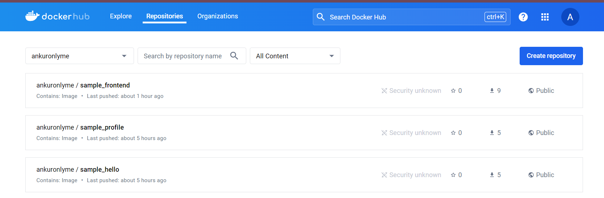

# Set Up AKS

    -  Add Resource Groups in Azure portal.

        Microsoft.Compute
        microsoft.insights
        Microsoft.ContainerInstance
        Microsoft.ContainerRegistry
        Microsoft.ContainerService
        Microsoft.Kubernetes
        Microsoft.KubernetesConfiguration
        Microsoft.KubernetesRuntime

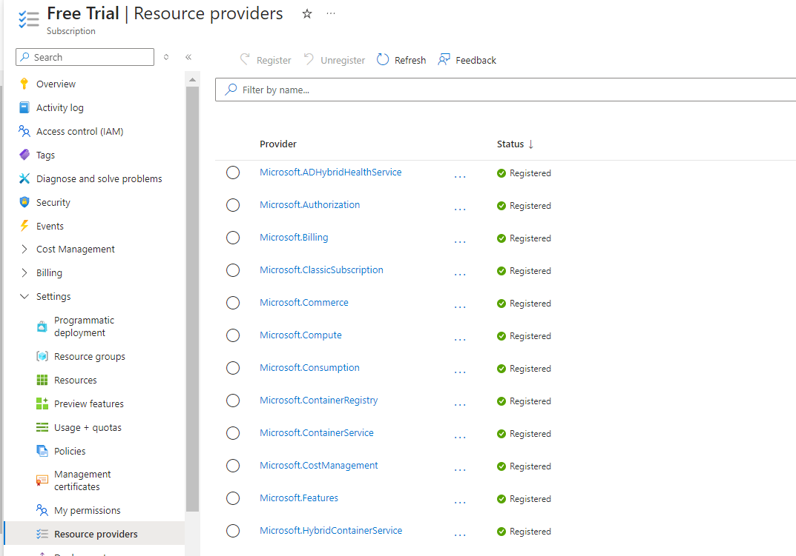

    - Resource group:

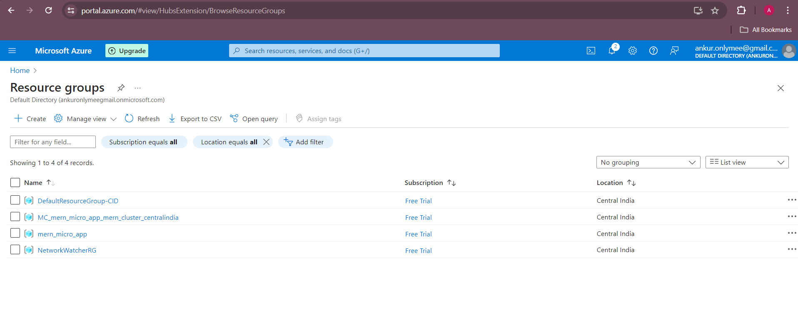

    - Kubernetes:

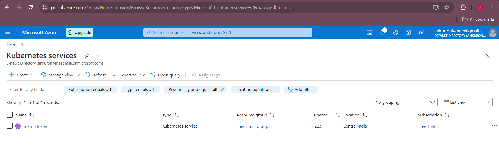

    - Login with azure in your terminal

        command: az login

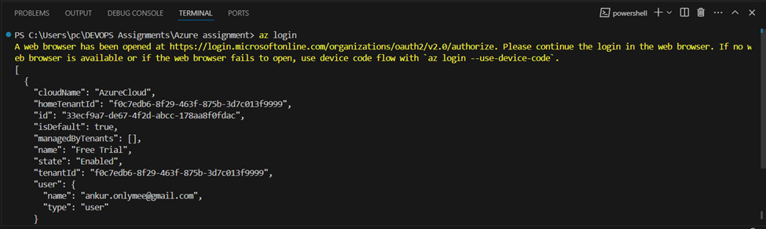

    - Creation of an AKS Cluster

        command: az aks create --resource-group mern_micro_app --name mern_cluster --node-count 2 --enable-addons monitoring --generate-ssh-keys

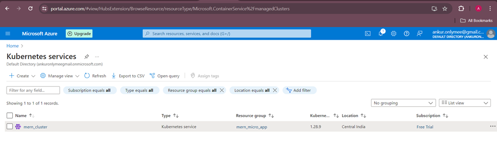

    - Get AKS Credentials

        command: az aks get-credentials --resource-group mern_micro_app --name mern_cluster

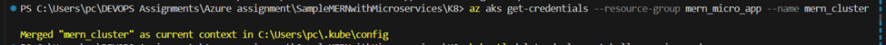

# Installation of Ingress

        command: kubectl apply -f https://raw.githubusercontent.com/kubernetes/ingress-nginx/main/deploy/static/provider/cloud/deploy.yaml

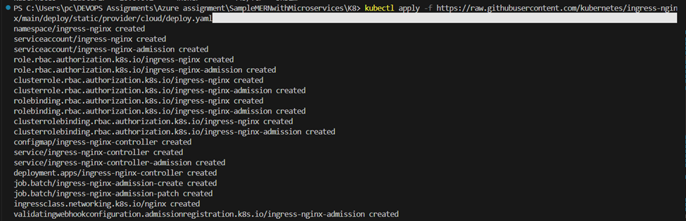

# Create & execute K8 deployment files and service files of frontend and backend:

        command: kubectl apply -f backend-deployment.yaml # put your file name 
                 kubectl apply -f backend-service.yaml # put your file name 
                 kubectl apply -f frontend-deployment.yaml # put your file name 
                 kubectl apply -f frontend-service.yaml # put your file name 

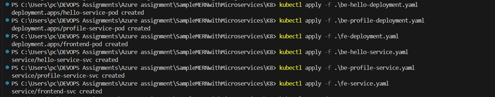

# Check Pods:

        command: kubectl get pods

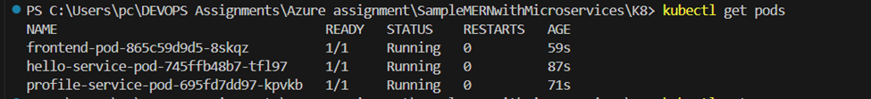

# Check svc:

        command: kubectl get svc

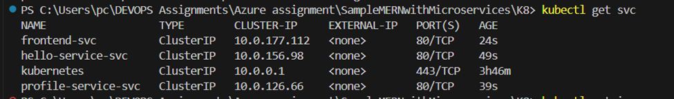

# Create an ingress file and excute that file:

        command: kubectl apply -f ingress.yaml # put your file name 

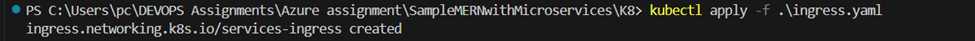

# Check get ingress:

        command: kubectl gbet ingress

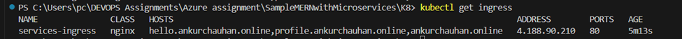

# Setup DNS:

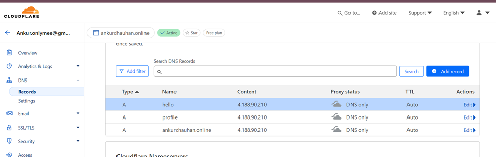

# Now check your frontend and backend with your domain name:

Frontend:

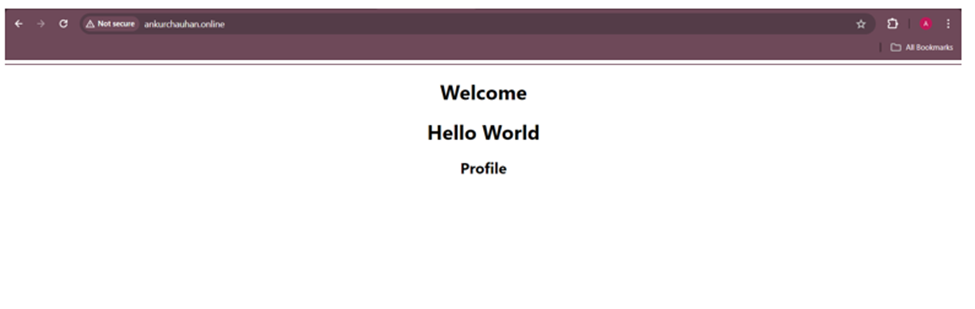
        

Backend:

    - Hello Service:

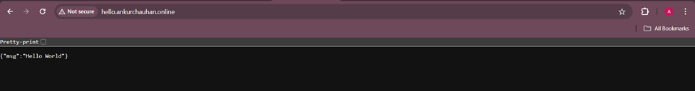

    - Profile Service:

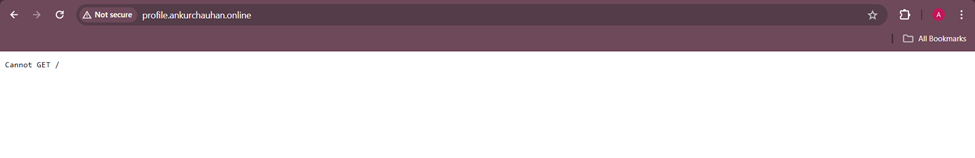

